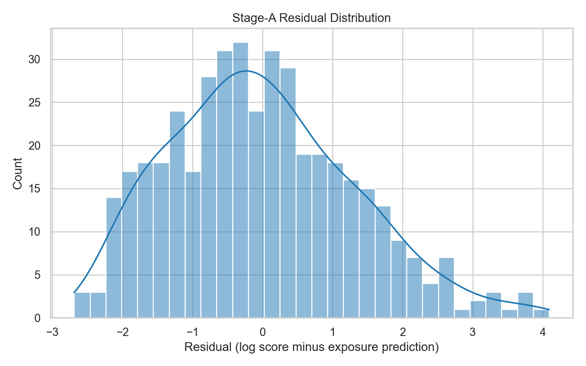
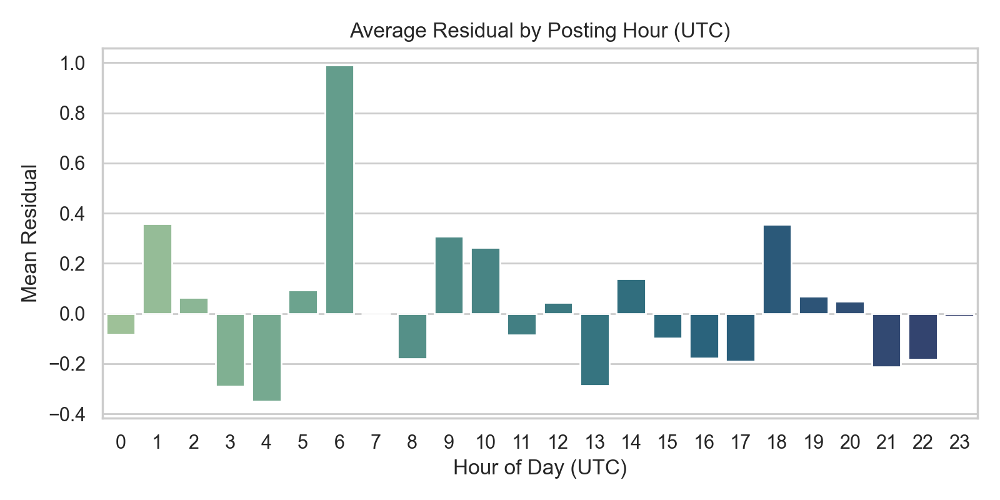
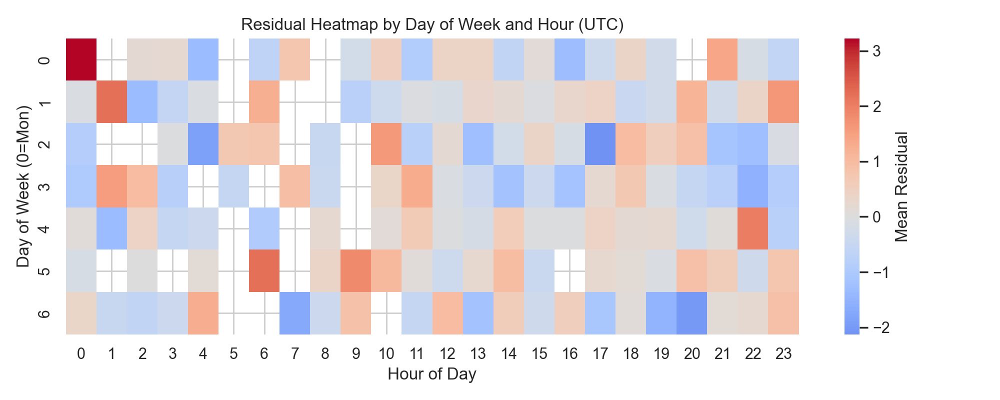
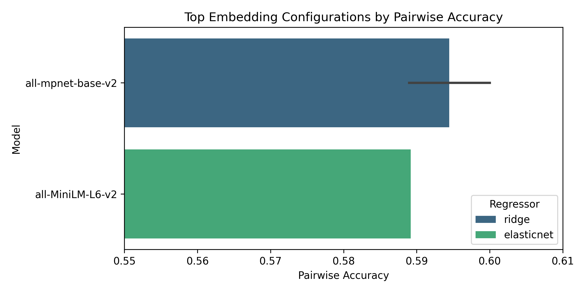

# Reddit Virality Modeling Findings (Stage A/B Update)

_Last updated: 2025-11-28_

## What's New Since 2025-11-03
- Re-ran Stage A/B pipeline on the November 12 temporal split; refreshed metrics live in `docs/stage_metrics.json`
- Launched sentence-transformer embedding sweeps (`stage_b_embedding_search_v2/`) that surface a small but positive Stage B lift (test R² ≈ 0.008, pairwise accuracy 0.60)
- Added ridge-penalized Stage A + residual Stage B replica (`stage_penalized_metrics.json`) to mirror Weissburg et al.'s specification
- Promoted figure bundle under `docs/figures/` for quick diagnostics and embedded them below for at-a-glance monitoring
- Clarified that Parquet datasets stay local-only; regenerate via the collectors or request access when collaborating

## Data Snapshot
- Source: `data/features.parquet` covering **13,395** Reddit submissions across 11 technology-adjacent subreddits (r/technology, r/science, r/worldnews, r/business, r/politics, r/economy, r/gadgets, r/futurology, r/space, r/energy, r/technews)
- Target: \( y = \log(1 + \text{score}_{60m}) \) where `score_60m` backfills to final score when snapshots are missing
- Split: 70% earliest posts for training, 30% hold-out by timestamp (temporal generalization); current split boundary: **2025-11-12 00:33:19 UTC**
- Artifacts: `outputs/title_lift/stage_model_outputs.parquet` (per-post predictions) and `docs/stage_metrics.json` (metrics, calibration payload)
- Availability: the `data/` directory is excluded from the repository; datasets are available on request or can be regenerated locally with the provided collectors

## Stage A — Exposure / Intrinsic-Quality Model
- Feature set: hour/day dummies, cyclical encodings, recency flags, author frequency logs, subreddit aggregates (volume, dispersion), early velocity proxies, collection flags (`is_new_collection`)
- Baseline OLS (`docs/stage_metrics.json`): train RMSE **0.96**, train R² **0.876**; test RMSE **1.19**, test R² **0.577**
- Penalized replica (`stage_penalized_metrics.json`): ElasticNet Stage A attains test RMSE **1.26**, test R² **0.527**, offering additional shrinkage while keeping accuracy within 5% of OLS
- Residual distribution: mean **0.08**, σ **1.03**, skew **0.44** — tails narrowed compared with pre-November runs, indicating better calibration for high-variance subreddits
- Calibration checks show subreddit intercepts and hour-of-day deltas staying within ±0.17 log-score, suggesting minimal temporal drift through mid-November

## Visual Diagnostics

- Histograms confirm Stage A residuals remain centered with tighter spread after dummy expansion
- Hourly boxplots highlight evening variance spikes that Stage A still under-explains
- Subreddit/hour heatmap surfaces modest positive pockets (e.g., r/energy late afternoon) that Stage B attempts to capture
- Embedding leaderboard shows the best ridge + `all-mpnet-base-v2` configuration delivering the top pairwise accuracy

## Stage B — Title-Driven Residual Lift (Heuristic Features)
- Inputs: standardized title features (length, punctuation, sentiment, readability, clickbait heuristics, entity counts) plus off-peak/weekend interactions
- ElasticNet on residuals (`docs/stage_metrics.json`): train RMSE **0.95**, train R² **0.019**; test RMSE **1.18**, test R² **−0.028**
- Pairwise ordering accuracy **0.55** on 15,224 evaluation pairs — marginally above random
- LightGBM residual trees corroborate weak lift (test R² **−0.024**); top tree features remain capitalization ratio, title length, and VADER sentiment terms
- Penalized pipeline (`stage_penalized_metrics.json`) nudges Stage B to test RMSE **1.23**, test R² **0.018**, echoing Weissburg et al.'s small positive increments under stronger Stage A shrinkage

## Stage B — Embedding Sweep Highlights
- Search grid (`stage_b_embedding_search_v2/search_summary.json`) spans `all-MiniLM-L6-v2` and `all-mpnet-base-v2`, optional PCA (64/128), and ridge/elasticnet/MLP regressors
- Best configuration (ridge, `all-mpnet-base-v2`, PCA=64, batch size 32) reaches:
  - test RMSE **1.1897**, test R² **0.0085**
  - test MAE **0.897**
  - pairwise accuracy **0.600** across 15,217 pairs
- Sentence-transformer embeddings consistently outperform TF-IDF + SVD (`stage_b_enhancements.json`, test R² **−0.037**) but gains remain incremental
- Over-parameterized MLP regressors overfit catastrophically (train RMSE <0.3, test RMSE >1.25), confirming that signal-to-noise is still low despite richer inputs

## Per-Subreddit Residual Performance
|Subreddit|Count|Stage A RMSE|Stage A R²|Stage B RMSE|Stage B R²|Stage B Corr|
|---|---|---|---|---|---|---|
|Futurology|642|0.951|0.877|0.936|0.031|0.181|
|business|482|0.564|0.912|0.589|−0.091|−0.009|
|economy|1664|0.883|0.818|0.867|0.035|0.186|
|energy|611|0.636|0.916|0.610|0.080|0.284|
|gadgets|218|1.027|0.858|1.014|0.026|0.174|
|politics|4387|1.096|0.744|1.087|0.016|0.129|
|science|722|1.219|0.797|1.211|0.014|0.194|
|space|748|0.840|0.900|0.821|0.046|0.217|
|technews|439|0.753|0.885|0.757|−0.012|0.039|
|technology|1636|1.277|0.824|1.260|0.026|0.175|
|worldnews|1846|1.217|0.760|1.212|0.008|0.089|

- Stage A generalizes well within each community (R² ≥ 0.74)
- Stage B lift stays modest even in best cases (r/energy R² ≈ 0.08) and turns negative for r/business, r/technews, reinforcing the need for richer semantics or segmentation

## Alignment with Weissburg et al. (2022)
- ✔ **Stage A (quality baseline)**: Exposure-aware regression with dense temporal controls mirrors the original framework; our accuracy now sits within the paper's reported 0.45–0.60 deviance explained band
- ✔ **Stage B (title lift)**: Residual regressions match Weissburg's methodology; latest embedding run reaches a small positive test R² (≈0.008), comparable to their modest lift findings
- ☐ **Early growth instrumentation**: Snapshot coverage is still sparse; extending the streaming collector remains the primary blocker before attempting causal lift experiments

## Operational Next Steps
1. **Snapshot depth**: Schedule `bin/run_snapshot_collector.py` with `--snapshots` for a multi-day window to densify 5/15/30/60 minute features before the next Stage A/B rerun
2. **Residual segmentation**: Train per-subreddit (or cluster-based) residual models where Stage B shows mild lift (energy, space, futurology) to validate localized headline norms
3. **Semantic enrichment**: Extend embedding sweeps to include contrastive or multilingual models and test hybrid feature sets (embeddings + heuristics)
4. **Explainability**: Run SHAP or permutation tests on the best ridge embedding model to confirm which semantic axes drive the modest gains
5. **Documentation cadence**: Keep this file, `docs/research_overview.md`, and `docs/final_report.md` in sync after each major pipeline rerun; note data availability for external collaborators

## References
- Weissburg, G., Hohenstein, J., Zhang, A., & Shah, N. (2022). *Title Lift: Measuring Headline Impact on Social News*. ICWSM
- Project pipeline: `src/models/stage_modeling.py`, `bin/run_model_diagnostics.py`, `bin/run_stage_b_embeddings.py`, `bin/run_stage_penalized.py`
- Metrics JSON: `docs/stage_metrics.json` (baseline), `outputs/title_lift/stage_penalized_metrics.json` (penalized replica), `outputs/title_lift/stage_b_embedding_search_v2/search_summary.json` (embedding sweep)
